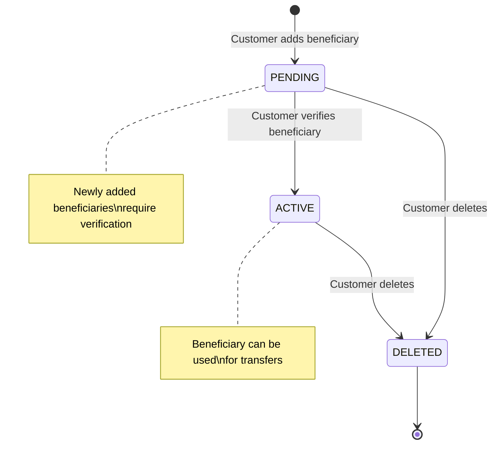
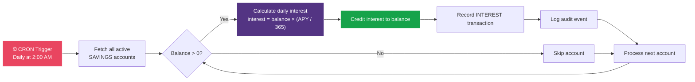
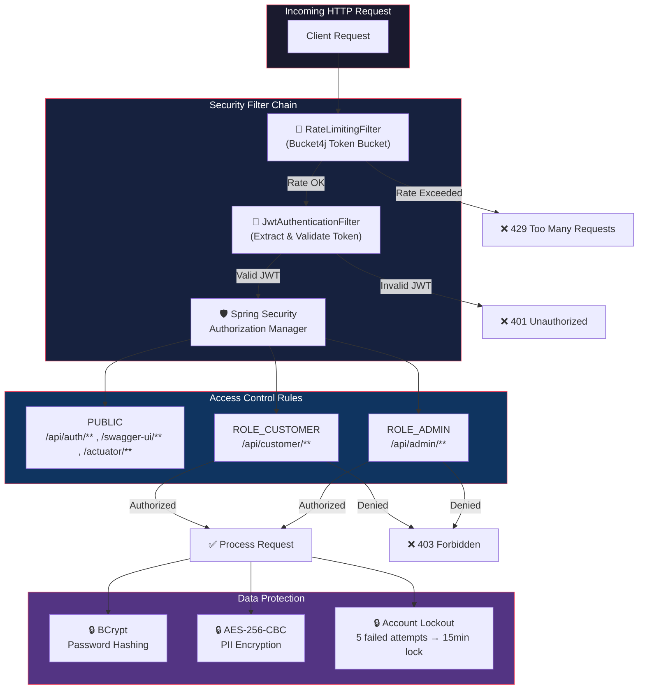
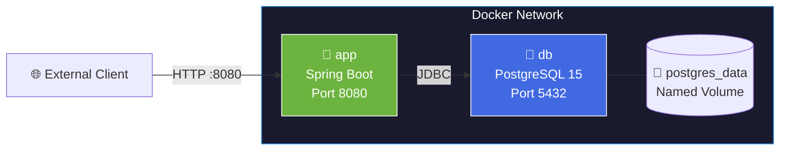
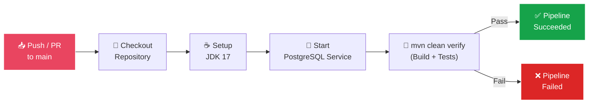

# 🏦 Online Banking System
    style M fill:#0f3460,stroke:#e94560,color:#fff
    style O fill:#16a34a,stroke:#fff,color:#fff
    style P fill:#16a34a,stroke:#fff,color:#fff
```

### Beneficiary Lifecycle



### Daily Interest Calculation



---

## 🔐 Security Architecture



### Security Features Summary

| Feature | Details |
|---|---|
| **Authentication** | JWT tokens with configurable expiration |
| **Password Storage** | BCrypt hashing (strength 10) |
| **PII Encryption** | AES-256-CBC for phone numbers & beneficiary account numbers |
| **Rate Limiting** | Token-bucket algorithm per IP address |
| **Brute Force Protection** | Auto-lock after 5 failed login attempts (15-min cooldown) |
| **Session Management** | Stateless — no server-side sessions (SessionCreationPolicy.STATELESS) |
| **CORS** | Configurable allowed origins, methods, and headers |
| **CSRF** | Disabled (appropriate for stateless JWT API) |

---

## 📚 API Reference

> **Interactive Docs**: Once the server is running, visit [`http://localhost:8080/swagger-ui.html`](http://localhost:8080/swagger-ui.html) for full Swagger UI documentation.

### Authentication

| Method | Endpoint | Description | Access |
|---|---|---|---|
| `POST` | `/api/auth/register` | Register a new customer account | 🌐 Public |
| `POST` | `/api/auth/login` | Authenticate & receive JWT token | 🌐 Public |

### Customer - Bank Accounts

| Method | Endpoint | Description | Access |
|---|---|---|---|
| `POST` | `/api/customer/accounts` | Create a new bank account | 🔐 CUSTOMER |
| `GET` | `/api/customer/accounts` | List all own accounts | 🔐 CUSTOMER |
| `GET` | `/api/customer/accounts/{accountNumber}` | Get account details | 🔐 CUSTOMER |
| `GET` | `/api/customer/accounts/{accountNumber}/balance` | Check balance | 🔐 CUSTOMER |
| `POST` | `/api/customer/accounts/{accountNumber}/deposit` | Deposit funds | 🔐 CUSTOMER |
| `POST` | `/api/customer/accounts/{accountNumber}/withdraw` | Withdraw funds | 🔐 CUSTOMER |

### Customer - Transactions

| Method | Endpoint | Description | Access |
|---|---|---|---|
| `POST` | `/api/customer/transactions/transfer` | Transfer funds between accounts | 🔐 CUSTOMER |
| `GET` | `/api/customer/transactions` | List all own transactions | 🔐 CUSTOMER |
| `GET` | `/api/customer/transactions/{accountNumber}` | Account transaction history | 🔐 CUSTOMER |

### Customer - Beneficiaries

| Method | Endpoint | Description | Access |
|---|---|---|---|
| `POST` | `/api/customer/beneficiaries` | Add a new beneficiary | 🔐 CUSTOMER |
| `GET` | `/api/customer/beneficiaries` | List all beneficiaries | 🔐 CUSTOMER |
| `PUT` | `/api/customer/beneficiaries/{id}/verify` | Verify a beneficiary | 🔐 CUSTOMER |
| `DELETE` | `/api/customer/beneficiaries/{id}` | Remove a beneficiary | 🔐 CUSTOMER |

### Customer - Statements

| Method | Endpoint | Description | Access |
|---|---|---|---|
| `GET` | `/api/customer/statements/{accountNumber}` | Download statement (PDF/CSV) | 🔐 CUSTOMER |

### Admin

| Method | Endpoint | Description | Access |
|---|---|---|---|
| `GET` | `/api/admin/users` | List all users (paginated) | 🔐 ADMIN |
| `GET` | `/api/admin/users/{userId}` | Get user details | 🔐 ADMIN |
| `PUT` | `/api/admin/users/{userId}/role` | Change user role | 🔐 ADMIN |
| `GET` | `/api/admin/accounts` | List all bank accounts | 🔐 ADMIN |
| `PUT` | `/api/admin/accounts/{accountNumber}/activate` | Activate account | 🔐 ADMIN |
| `PUT` | `/api/admin/accounts/{accountNumber}/deactivate` | Deactivate account | 🔐 ADMIN |
| `GET` | `/api/admin/transactions` | List all transactions (filterable) | 🔐 ADMIN |
| `GET` | `/api/admin/audit-logs` | View audit logs | 🔐 ADMIN |

### Sample API Request & Response

**Register a New User**
```bash
curl -X POST http://localhost:8080/api/auth/register \
  -H "Content-Type: application/json" \
  -d '{
    "email": "john.doe@example.com",
    "password": "SecureP@ss123",
    "firstName": "John",
    "lastName": "Doe",
    "phone": "+1234567890"
  }'
```

**Response**
```json
{
  "timestamp": "2026-05-29T12:30:00Z",
  "status": 201,
  "message": "Registration successful",
  "data": {
    "token": "eyJhbGciOiJIUzI1NiIs...",
    "email": "john.doe@example.com",
    "role": "ROLE_CUSTOMER"
  }
}
```

**Transfer Funds**
```bash
curl -X POST http://localhost:8080/api/customer/transactions/transfer \
  -H "Authorization: Bearer <YOUR_JWT_TOKEN>" \
  -H "Content-Type: application/json" \
  -d '{
    "sourceAccountNumber": "1234567890",
    "destinationAccountNumber": "0987654321",
    "amount": 500.00,
    "description": "Rent payment"
  }'
```

---

## 📁 Project Structure

```
Online_banking/
├── .github/
│   └── workflows/
│       └── ci.yml                          # GitHub Actions CI/CD pipeline
├── src/
│   ├── main/
│   │   ├── java/com/onlinebanking/
│   │   │   ├── OnlineBankingApplication.java       # Spring Boot entry point
│   │   │   ├── auth/
│   │   │   │   └── AuthenticationService.java      # Registration & login logic
│   │   │   ├── config/
│   │   │   │   ├── SecurityConfig.java             # Security filter chain
│   │   │   │   ├── OpenApiConfig.java              # Swagger/OpenAPI setup
│   │   │   │   ├── JwtProperties.java              # JWT configuration props
│   │   │   │   ├── AesProperties.java              # Encryption config props
│   │   │   │   ├── DataInitializer.java            # Seed roles & admin user
│   │   │   │   ├── AsyncConfig.java                # Async executor config
│   │   │   │   ├── SchedulingConfig.java           # Scheduled tasks config
│   │   │   │   └── JpaAuditingConfig.java          # JPA auditing setup
│   │   │   ├── controller/
│   │   │   │   ├── AuthController.java             # Auth endpoints
│   │   │   │   ├── BankAccountController.java      # Account operations
│   │   │   │   ├── TransactionController.java      # Transfer/history
│   │   │   │   ├── BeneficiaryController.java      # Beneficiary CRUD
│   │   │   │   ├── StatementController.java        # PDF/CSV statements
│   │   │   │   └── AdminController.java            # Admin operations
│   │   │   ├── dto/                                # Request/Response DTOs
│   │   │   ├── entity/                             # JPA Entities
│   │   │   │   ├── User.java
│   │   │   │   ├── Role.java / RoleName.java
│   │   │   │   ├── BankAccount.java / AccountType.java
│   │   │   │   ├── TransactionRecord.java / TransactionType.java
│   │   │   │   ├── Beneficiary.java / BeneficiaryStatus.java
│   │   │   │   └── AuditLog.java / AuditEventType.java
│   │   │   ├── exception/
│   │   │   │   ├── ApiException.java               # Custom exception
│   │   │   │   └── GlobalExceptionHandler.java     # @ControllerAdvice
│   │   │   ├── repository/                         # Spring Data JPA repos
│   │   │   ├── security/
│   │   │   │   ├── JwtService.java                 # Token generation/validation
│   │   │   │   ├── JwtAuthenticationFilter.java    # Request filter
│   │   │   │   ├── RateLimitingFilter.java         # Rate limiter
│   │   │   │   ├── EncryptionService.java          # AES-256 encryption
│   │   │   │   ├── CustomUserDetailsService.java   # UserDetailsService impl
│   │   │   │   └── BankUserDetails.java            # UserDetails impl
│   │   │   ├── service/
│   │   │   │   ├── BankAccountService.java         # Account business logic
│   │   │   │   ├── TransactionService.java         # Transfer logic
│   │   │   │   ├── BeneficiaryService.java         # Beneficiary management
│   │   │   │   ├── StatementService.java           # PDF/CSV generation
│   │   │   │   ├── InterestService.java            # Scheduled interest calc
│   │   │   │   ├── EmailService.java               # Async email sending
│   │   │   │   ├── AdminService.java               # Admin operations
│   │   │   │   └── AuditLogService.java            # Audit trail
│   │   │   └── util/
│   │   │       ├── AccountNumberGenerator.java     # 10-digit account gen
│   │   │       └── AttributeEncryptor.java         # JPA @Converter for AES
│   │   └── resources/
│   │       ├── application.yml                     # Main configuration
│   │       ├── application-dev.yml                 # Dev profile config
│   │       └── db/migration/                       # Flyway SQL migrations
│   └── test/                                       # Test sources
├── Dockerfile                                      # Multi-stage Docker build
├── docker-compose.yml                              # App + PostgreSQL
├── pom.xml                                         # Maven dependencies
├── .env.example                                    # Environment template
└── README.md                                       # This file
```

---

## 🚀 Getting Started

### Prerequisites

- **Java 17+** (JDK)
- **Maven 3.9+**
- **PostgreSQL 15** (or use Docker)
- **Git**

### 1. Clone the Repository

```bash
git clone https://github.com/<your-username>/online-banking.git
cd online-banking
```

### 2. Configure Environment

```bash
cp .env.example .env
# Edit .env with your actual values
```

### 3. Set Up Database

```bash
# Option A: Using Docker (recommended)
docker run -d --name banking-db \
  -e POSTGRES_DB=online_banking \
  -e POSTGRES_USER=postgres \
  -e POSTGRES_PASSWORD=your-db-password \
  -p 5432:5432 \
  postgres:15

# Option B: Manual setup
createdb online_banking
```

### 4. Build & Run

```bash
# Build the project
mvn clean install -DskipTests

# Run the application
mvn spring-boot:run
```

### 5. Access the Application

| Resource | URL |
|---|---|
| **API Base URL** | `http://localhost:8080` |
| **Swagger UI** | `http://localhost:8080/swagger-ui.html` |
| **OpenAPI Spec** | `http://localhost:8080/v3/api-docs` |
| **Actuator Health** | `http://localhost:8080/actuator/health` |

### Default Admin Account

The application auto-creates an admin user on first startup:

| Field | Value |
|---|---|
| **Email** | `admin@bank.com` |
| **Password** | `Admin@123` |
| **Role** | `ROLE_ADMIN` |

---

## 🐳 Docker Deployment

### Using Docker Compose (Recommended)

```bash
# Build and start all services
docker-compose up -d --build

# View logs
docker-compose logs -f app

# Stop services
docker-compose down
```

### Docker Compose Architecture



### Standalone Docker Build

```bash
# Build the image
docker build -t online-banking .

# Run the container
docker run -p 8080:8080 \
  -e DB_HOST=host.docker.internal \
  -e DB_PORT=5432 \
  -e DB_NAME=online_banking \
  -e DB_USERNAME=postgres \
  -e DB_PASSWORD=your-db-password \
  -e JWT_SECRET=your-256-bit-secret-key \
  -e AES_SECRET=your-aes-secret \
  online-banking
```

---

## ⚡ CI/CD Pipeline

The project includes a GitHub Actions workflow that runs on every push and pull request to `main`/`master`:



**Pipeline features**:
- Runs on `ubuntu-latest`
- Provisions PostgreSQL 15 as a service container with health checks
- Uses Temurin JDK 17 with Maven caching
- Executes full build + test suite

---

## ⚙️ Environment Variables

| Variable | Description | Default | Required |
|---|---|---|---|
| `DB_HOST` | PostgreSQL host | `localhost` | ✅ |
| `DB_PORT` | PostgreSQL port | `5432` | ✅ |
| `DB_NAME` | Database name | `online_banking` | ✅ |
| `DB_USERNAME` | Database username | `postgres` | ✅ |
| `DB_PASSWORD` | Database password | `your-db-password` | ✅ |
| `JWT_SECRET` | Secret key for JWT signing (min 256 bits) | `your-jwt-secret` | ✅ |
| `AES_SECRET` | 32-char hex string for AES-256 encryption | `your-aes-secret` | ✅ |
| `MAIL_HOST` | SMTP server host | `smtp.gmail.com` | ❌ |
| `MAIL_PORT` | SMTP server port | `587` | ❌ |
| `MAIL_USERNAME` | SMTP username/email | — | ❌ |
| `MAIL_PASSWORD` | SMTP password / app password | — | ❌ |

> ⚠️ **Security Note**: Never commit `.env` files to version control. Use GitHub Secrets for CI/CD pipelines.

---

## 🤝 Contributing

Contributions are welcome! Here's how to get started:

1. **Fork** the repository
2. **Create** a feature branch: `git checkout -b feature/amazing-feature`
3. **Commit** your changes: `git commit -m 'feat: add amazing feature'`
4. **Push** to the branch: `git push origin feature/amazing-feature`
5. **Open** a Pull Request

### Commit Convention

This project follows [Conventional Commits](https://www.conventionalcommits.org/):

| Prefix | Usage |
|---|---|
| `feat:` | New feature |
| `fix:` | Bug fix |
| `docs:` | Documentation only |
| `refactor:` | Code refactoring |
| `test:` | Adding/updating tests |
| `chore:` | Build/tooling changes |

---

## 📄 License

This project is licensed under the **MIT License** — see the [LICENSE](LICENSE) file for details.

---

<div align="center">

### ⭐ Star this repository if you found it helpful!

Built with ❤️ using **Spring Boot** and **Java 17**

</div>
]]>
>>>>>>> 1621e7d (chore: initial commit — sanitize secrets and prepare repo)
